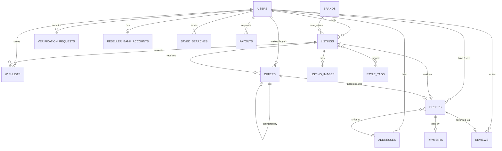
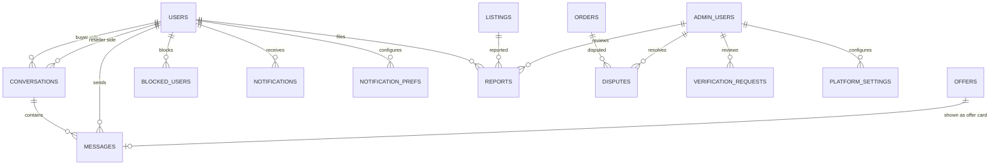

# Database ERD

Source of truth is `apps/api/prisma/schema.prisma`. This doc is the human-readable summary approved before Phase 1 began.

## Identity, catalog & commerce

## Communication, trust & admin

## Notes

- Escrow is modeled as a status on `payments` (`HELD` → `RELEASED`/`REFUNDED`) rather than a separate ledger table. A dedicated `ledger_entries` table can be added before Phase 4 if a full audit trail of fund movements is needed.
- `regions`/`cities` are reference tables seeded with all 13 Saudi administrative regions — see `apps/api/prisma/seed.ts`.
- `platform_settings` is a key/value table holding the configurable knobs from the brief: service fee %, minimum listing price, max photos per listing, OTP expiry, payout minimum threshold, dispute window, boost pricing.
